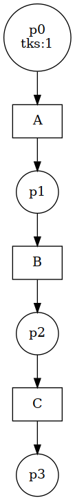
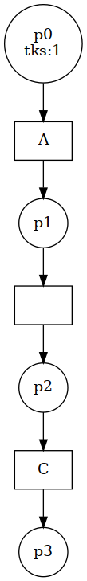
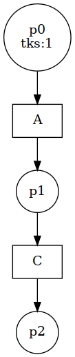
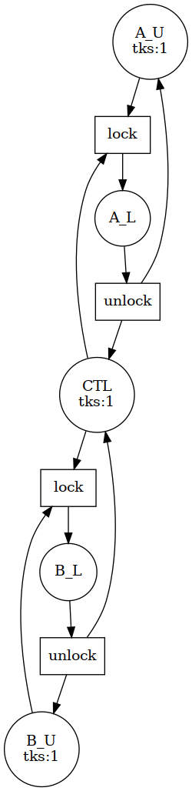
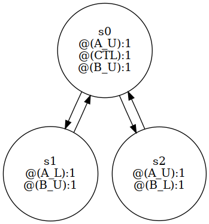
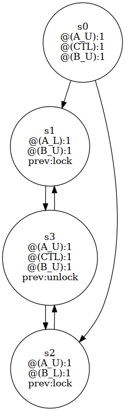

# PETRICHECK

This micro library provides utilities to:
- define basic Place/Transition [Petri Nets](https://en.wikipedia.org/wiki/Petri_net)
- parse such Petri Nets from [PNML files](https://www.pnml.org/)
- relabel places and transitions
- reduce Petri Nets so they are smaller in size (less places, less transitions)
- construct [Kripke structures](https://en.wikipedia.org/wiki/Kripke_structure_(model_checking)) from the reachability graph of a Petri Net
- [model-check](https://en.wikipedia.org/wiki/Model_checking) [CTL](https://en.wikipedia.org/wiki/Computation_tree_logic) formulae on a Kripke structure constructed from a Petri Net


## Example for relabelling and reduction

The table below illustrates transition relabelling and reduction.

| initial  | After relabelling "C→∅"  | After reduction  |
|---|---|---|
|  |  |   |


## Example for Kripke structure generation and model checking

Let us consider the following example of a Petri Net:



It represents a concurrent access to a shared resource by two actors : A and B.
A lock prevents simultaneous access to the resource.

At the start, both A and B do not have the lock, which is represented by:
- the places `A_U` (for Unlock) and `B_U` having one token each
- the places `A_L` (for Lock) and `B_L` having zero token each

When the lock can be claimed, we have one token on place `CTL` (for CONTROL).

### Kripke states carrying distribution of tokens

One can generate the following Kripke structure from the Reachability graph of the Petri Net.
Each Kripke state carries a distribution of the tokens among the places of the Petri Net.



At the initial state `s0` we have one token in `A_U`, one in `B_U` and one in `CTL`.

From here:
- either actor `A` acquires the lock, which leads to state `s1`, having one token in `A_L`
- or it is actor `B` that acquires the lock, which leads to state `s2`, having one token in `B_L`

From either `s1` or `s2`, the actor that has the lock can release it and the system goes back to state `s0`.

One can verify, for instance, the following CTL formulae on this system (c.f. `/tests/` for more examples):
- At initialization:
```(tokens-count("A_L")=0)&(tokens-count("B_L")=0)```
- A and B can't have both the lock at the same time:
```A(G(!((tokens-count("A_L")>0)&(tokens-count("B_L")>0))))```
- A can either have or not have the lock:
```A(G( ((tokens-count("A_L")=0)&(tokens-count("A_U")=1)) | ((tokens-count("A_L")=1)&(tokens-count("A_U")=0)) ))```
- It is always possible to fire a lock or unlock transition:
```A(G( (is-fireable("lock")) | (is-fireable("unlock"))  ))```


The nature of these atomic propositions and their syntax is adapted from
those proposed in the [model checking contest](https://mcc.lip6.fr/2025/)
e.g., `tokens-count("place_name") > x` and `is-fireable("transition_label")`.


### Kripke states that also include the previous transition label

One can generate a different Kripke structure from the execution of the Petri Net, in which states also include information about the previous transition that was fired.



With such Kripke structures, we may also consider atomic propositions of the form `is-previous("transition_label")` which allows us to mimic a restricted form of past tense temporal logic constraint.

For instance:
- After a "lock" has been fired, CTL has not token:
```A(G( (is-previous("lock")) => (tokens-count("CTL")=0) ))```
- Can never fire two transition with label "lock" in a row:
```A(G( (is-previous("lock")) => (A(X( !(is-previous("lock")) ))) ))```

The same Petri Net can generate various such Kripke structure up to relabelling of the transitions.

